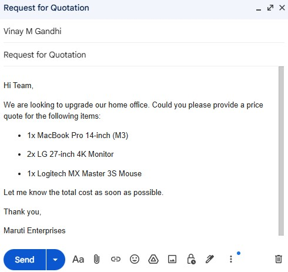
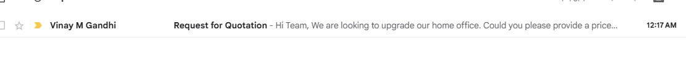
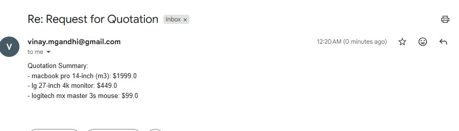
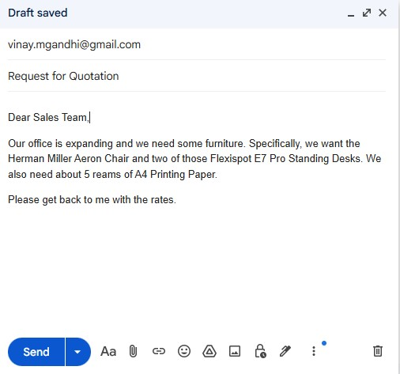
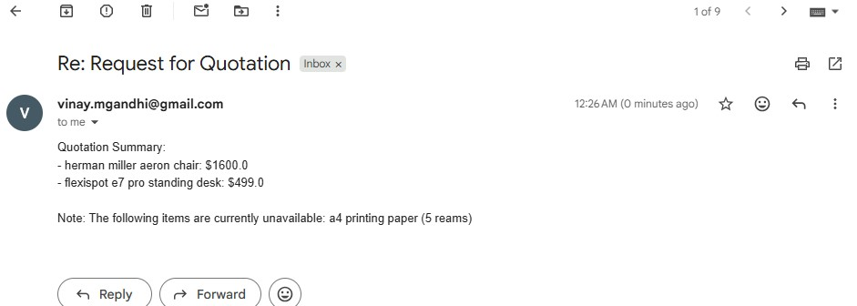

# 🚀 QuoteFlow AI: Automated RFQ Processor

**QuoteFlow AI** is an intelligent automation system that monitors your Gmail inbox for "Request for Quotation" (RFQ) emails, extracts product details using **Gemini 1.5 Flash**, queries an internal database for pricing, and automatically replies to the customer with a professional quote.


## 🛠️ Features
* **Intelligent Extraction**: Uses Gemini 1.5 Flash to parse messy or conversational emails into structured product lists.
* **Database Matching**: Cross-references requests against a valid inventory list to ensure 100% price accuracy.
* **Automated Communication**: Handles the full email loop, including "Product Not Found" notifications.
* **Reliable Scheduling**: Runs on a 5-minute heartbeat to ensure fast response times for customers.

## 📂 Project Structure
```text
quoteflow_ai/
├── main.py             # Entry point & 5-minute loop logic
├── agent.py            # LangGraph workflow & Gemini AI logic
├── gmail_service.py    # Gmail API authentication and message handling
├── database.py         # Mock inventory database and lookup functions
├── .env                # Private API keys (not tracked in git)
├── credentials.json    # Google OAuth credentials (from Google Cloud)
├── token.json          # Generated automatically after first login
├── requirements.txt    # Python dependencies
└── README.md           # This file

## Setup

1. **Prerequisites**:

- Python 3.10+ installed.
- A [Google Cloud Project](https://console.cloud.google.com/) with the Gmail API enabled.
- A [Google AI Studio](https://aistudio.google.com/) API Key for Gemini.

2. **Clone and Install**:

   ```bash
    # Clone the repository
    git clone https://github.com/vinaygandhigit/gmail_agent.git
    cd gmail_agent
    
    # Install dependencies
    pip install -r requirements.txt
   ```

3. **Configure Google API (Gmail)**

   1. Go to APIs & Services > Credentials in Google Cloud Console.
   2. Create an OAuth 2.0 Client ID (Application Type: Desktop App).
   3. Download the JSON file, rename it to credentials.json, and move it to the project root.
   4. The first time you run the script, a browser tab will open. Log in with your Gmail account to generate token.json.

4. **Run the Project**
   ```bash
   python main.py
   ```

5. **Output**

   1. Send an email to company asking for Quotation 
      <kbd><kbd>

   2. Received an email in gmail inbox
      <kbd><kbd>
      
   3. Get auto reply from company with quotation price
      <kbd><kbd>
      
   4. Send another quotation email (non available product)
      <kbd><kbd>
   
   5. Get auto reply with quotation price and not available product remark
      <kbd><kbd>

## License

MIT License
